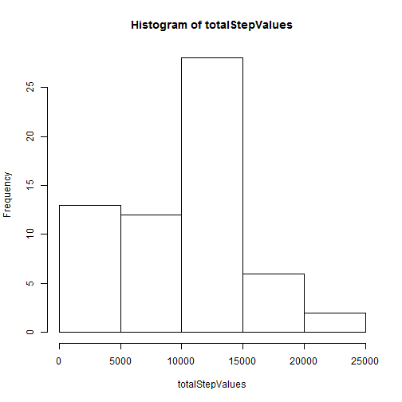
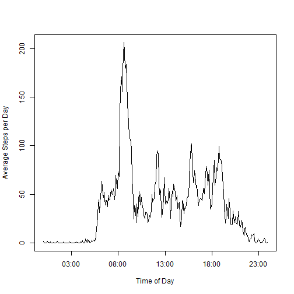
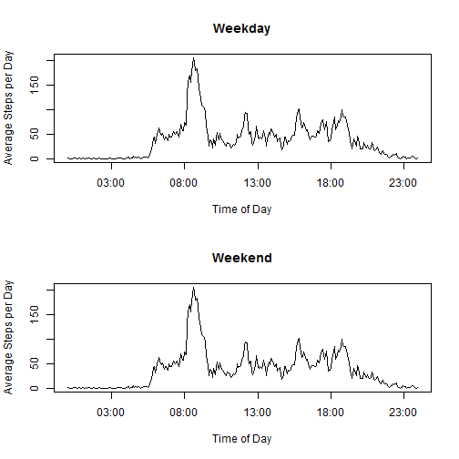
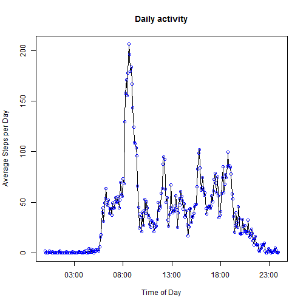

## Loading and preprocessing the data

```r
## Unzipping the data, loading it into a data frame.
unzip("activity.zip")
data <- read.csv(file = "activity.csv", header = TRUE)

## Tries to remove the file from the hard disk after loading it. Returns a
## boolean value indicating wether it succesfully executed.
file.remove("activity.csv")
```

```
## [1] TRUE
```

```r
## Transforming days (as factors) into time variables - this does not take
## into account the time of day.
data$date <- strptime(data$date, format="%Y-%m-%d")
```

## What is mean total number of steps taken per day?

```r
## Define a new sum function that already removes the NA values.
newsum <- function(x){ sum(x,na.rm=TRUE)}

## This function computes the total number of steps on a data frame containing 
## step count information in the format [date, number of steps,interval,...]
totalSteps <- function(inputData){
      ## Groups dates into factors by days.
      stepsgroupedByDay <- split(data$steps,cut(inputData$date,breaks="day"))
      
      ## To compute the total number of steps per day we can split the number
      ## of steps according to the date labels and apply the newsum function.
      totalStepsPerDay <- sapply(stepsgroupedByDay, newsum)
}

totalStepValues <- totalSteps(data)
hist(totalStepValues)
```

 

```r
mean(totalStepValues)
```

```
## [1] 9354.23
```

```r
median(totalStepValues)
```

```
## [1] 10395
```


## What is the average daily activity pattern?

```r
## Note that the interval format is just recording the digits appearing in a
## digital clock, i.e. "1605" corresponds to 4.05 pm or 16:05

## Define a short hand version of the function mean(x, na.rm = TRUE)
newmean <- function(x){mean(x,na.rm =TRUE)}

## This function computes the activity pattern on a data frame containing 
## step count information in the format [date, number of steps,interval,...]
activityPattern <- function(inputData){
      splitData <- split(inputData$steps,inputData$interval)
      avgActivityPerDay <-  sapply(splitData,newmean)
      time <- as.numeric(names(avgActivityPerDay))
      hour <- as.character( (time - time%%100)/100 )
      minute<- as.character(time %%100)
      timeStamps <- paste(hour,minute,"00", sep =":")
      timeOfDay <- strptime(timeStamps,format="%H:%M:%S")
      list(timeOfDay = timeOfDay, averageActivityPerDay = avgActivityPerDay,
           times=time)
}

## averageActivityPerDay contains the average number of steps, over 5 minute
## intervals, across all of the days in the data set.
computedActivity <- activityPattern(data)
averageActivityPerDay <-  computedActivity$averageActivityPerDay
times <- computedActivity$times
timeOfDay <- computedActivity$timeOfDay

### Constructing a plot of the averageActivityPerDay vs. the time of day.

plot(timeOfDay,averageActivityPerDay, type ="l",xlab ="Time of Day",
     ylab="Average Steps per Day")
```

 

```r
dev.copy
```

```
## function (device, ..., which = dev.next()) 
## {
##     if (!missing(which) & !missing(device)) 
##         stop("cannot supply 'which' and 'device' at the same time")
##     old.device <- dev.cur()
##     if (old.device == 1) 
##         stop("cannot copy from the null device")
##     if (missing(device)) {
##         if (which == 1) 
##             stop("cannot copy to the null device")
##         else if (which == dev.cur()) 
##             stop("cannot copy device to itself")
##         dev.set(which)
##     }
##     else {
##         if (!is.function(device)) 
##             stop("'device' should be a function")
##         else device(...)
##     }
##     on.exit(dev.set(old.device))
##     .External(C_devcopy, old.device)
##     on.exit()
##     dev.cur()
## }
## <bytecode: 0x0000000008cdffb8>
## <environment: namespace:grDevices>
```

```r
### Determining the interval(s) containing the largest average steps per day.

highestAvgSteps <- max(averageActivityPerDay)
times[averageActivityPerDay==highestAvgSteps]
```

```
## [1] 835
```

It seems that the data on this person indicates that their activity peaks at 8:35 am as indicated by the label "835" and can be seen in the previous plot.


## Inputing missing values

```r
### Counting the total number of missing values.
## Replacing NAs with the 5-min time-interval average corresponding to 
## the missing value.
boolNaIndices <- is.na(data$steps)
totalNAs <- sum( boolNaIndices )

### Replacing the missing values with the average value for the corresponding interval.
newdata <- data

replaceNA <- function(x){ 
      averageActivityPerDay[as.character(x)]
      }

newdata[boolNaIndices,]$steps <- sapply(data[boolNaIndices,]$interval, replaceNA)

### Computing the median and mean of total number of steps per day in the new 
### data
## We use the previously defined totalSteps function and then compute the mean
## and median and construt a histogram to show the frequency count of total step
## in the filled in data.
totalStepValues <- totalSteps(newdata)
hist(totalStepValues)
```

 

```r
mean(totalStepValues)
```

```
## [1] 9354.23
```

```r
median(totalStepValues)
```

```
## [1] 10395
```

One expects that by replacing missing values by estimates would tend to bias the results towards the estimated value. In this case it was expected that the bias would be toward the average number of steps per time interval. Somewhat suprisingly it seems that this did not have much influence on the mean and median since the values are same.

## Are there differences in activity patterns between weekdays and weekends?

```r
weekDay_or_weekEnd <- function(x){
      dayOfX <- weekdays(x)
      typeOfDay <- character(length(x))
      typeOfDay[dayOfX=="Sunday"|dayOfX=="Saturday"] = "weekend"
      typeOfDay[!(dayOfX=="Sunday"|dayOfX=="Saturday")] = "weekday"
      return(typeOfDay)
}
newdata$weekday_or_weekend <- weekDay_or_weekEnd(data$date)

## Separates the data by weekday vs. weekend
splitData <- split(newdata, newdata$weekday_or_weekend)

## Computes the activity pattern separately for weekdays and weekends
weekendActivity <- activityPattern(splitData[["weekend"]])
splitData[["weekend"]]$averageActivity <- weekendActivity$averageActivityPerDay

weekdayActivity <- activityPattern(splitData[["weekday"]])
splitData[["weekday"]]$averageActivity <- weekdayActivity$averageActivityPerDay

## Construct a panel plot showing the average activity time series for weekends
## vs. weekdays
par(mfrow=c(2,1))
with(splitData[["weekday"]],plot(timeOfDay,averageActivityPerDay, type ="l",xlab
                                 ="Time of Day",ylab="Average Steps per Day",
                                 main= "Weekday") )
with(splitData[["weekend"]],plot(timeOfDay,averageActivityPerDay, type ="l",xlab
                                 ="Time of Day",ylab="Average Steps per Day",
                                 main= "Weekend") )
```

 


## Comments about the results obtained from this analysis (Unrelated to assignment but fun).
The way that it is plotted hides small differences. So perhaps it is worth considering a plot that overlays the two time series.

```r
with(splitData[["weekday"]],plot(timeOfDay,averageActivityPerDay, type ="l",xlab
                                 ="Time of Day",ylab="Average Steps per Day",
                                 main= "Daily activity") )
with(splitData[["weekend"]],points(timeOfDay,averageActivityPerDay,col="blue") )
```

 

Supprisingly, it seems that this person has the same activity pattern over weekdays as they have over weekends. This could either be a funny coincidence or more likely most of the missing values are from the weekends. Since I replaced the missing values with the interval averages and weekends are likely to yield NA. So lets examine this hypothesis :D!

##

```r
data$weekday_or_weekend <- weekDay_or_weekEnd(data$date)
splitOldData <- split(data, data$weekday_or_weekend)
sum(is.na(splitOldData[["weekday"]]$steps))/length(splitOldData[["weekday"]]$steps)
```

```
## [1] 0.1333333
```

```r
sum(is.na(splitOldData[["weekend"]]$steps))/length(splitOldData[["weekend"]]$steps)
```

```
## [1] 0.125
```

Amazing! The proportion of missing values is the same in both weekdays and weekends so its unlikely that the filling in proceedure biased the results! :D wow!
